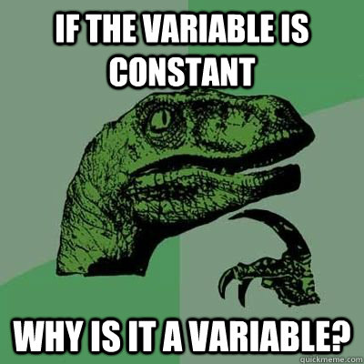

# Constants

A constant is similar to a variable in that it also holds a value, but
unlike a variable, the value of a constant cannot change once it has
been assigned. Constants are used when you want to ensure that a value
stays the same throughout the entire program.

A constant is:

- A named place in memory like a variable

- But the value cannot change once it is set

Think of a constant as a box with a label that is sealed shut after you
put something inside.

## Key Features of Constants:

- Name

  - Constants also have names, just like variables.

  - By convention, constants are often written in uppercase letters to
    distinguish them from variables (e.g., pi, MAX_SPEED).

- Fixed Value

  - The value of a constant is set once and doesn't change while the
    program runs.

- Purpose

  - Constants are useful when you have values that should remain the
    same, such as the number of hours in a day or mathematical constants
    like π (pi) or the force of gravity on Earth (9.81ms\^2).

Some programming languages create constants in different ways.

## Why Do We Need Constants?

Sometimes in programming, you have values that:

- Never change during the program

- Are used in multiple places

- Would cause problems if accidentally changed

For example:

- The number of hours in a day → 24

- The mathematical value of pi → 3.14159

- A sales tax rate in a program → 0.07

It's better to give these values a name (like HOURS_IN_DAY or
SALES_TAX_RATE) rather than just sprinkling numbers into your code. This
makes the program easier to understand and avoids mistakes.

## Constants vs. Variables

- A variable can change (like score in a game)

- A constant stays the same (like MAX_SCORE = 100)

If you accidentally try to change a constant, the programming language
may give you an error, reminding you: "*This value should never
change.*"

{width="4.166666666666667in"
height="4.166666666666667in"}

NOTE: in [[code.org]{.underline}](http://code.org) there isn't a
draggable button for constants, and using the keyword const also causes
an error. We will use UPPERCASE variables to show that we intend them to
be constants even if that is not strictly permitted.
