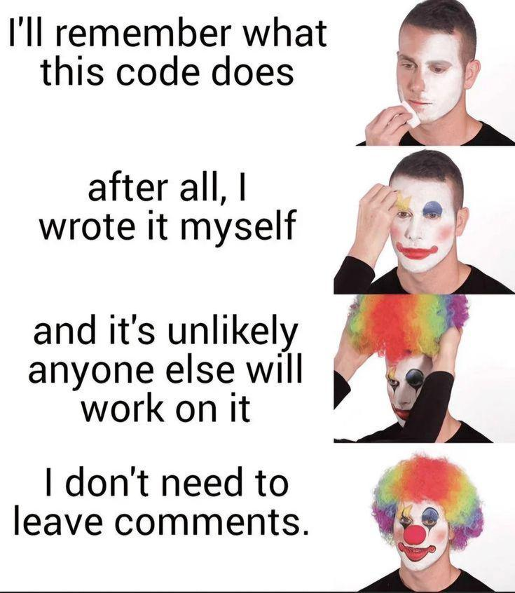
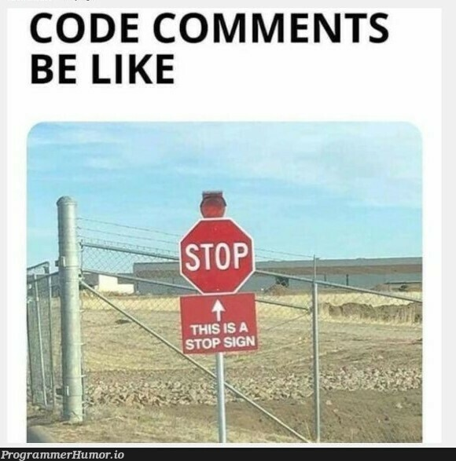

# Comments

Comments in a program are lines of text that are written within the code
but are not executed by the computer. Programmers use comments to leave
notes, explanations, or instructions that help make the code easier to
understand for themselves or others who may read or work on the code
later. Comments are purely for human readers and have no effect on how
the program runs.

Comments are a critical part of writing clear, maintainable code. They
provide explanations and context, making the code easier to understand
for others (or for you when you return to the code later). By using
comments effectively, programmers can make their code more readable,
collaborative, and easier to debug.

## Where do comments go?

- Above the line, function or block of code they describe

- At the end of a line of code

  - Quick reminder for a single line

- At the beginning of a file as an overview

  - Purpose

  - Author

  - Version

  - Etc

- Function doc tags

  - Directly before a function declaration to provide Intellisense with
    data

## Why Are Comments Important?

- Explain Code: Comments help explain what a section of code is doing,
  especially when the code might be complex or difficult to understand
  at a glance.

- Improve Collaboration: In projects with multiple developers, comments
  make it easier for team members to understand each other\'s work,
  speeding up collaboration and reducing mistakes.

- Document Important Information: Comments can be used to record things
  like the purpose of a function, why a certain approach was chosen, or
  even what needs to be fixed or improved later (often marked with
  TODO).

- Assist in Debugging: Comments can help you or others know what each
  part of the code should be doing, making it easier to find and fix
  errors during debugging.

{width="4.442708880139983in"
height="5.110566491688539in"}

## Types of Comments

There are typically two types of comments used in programming:

### Single-Line Comments:

These comments occupy a single line and are often used to explain
specific lines or small blocks of code. In many languages, single-line
comments are created by placing a special character like #, //, or \--
before the comment.

**//this variable is for testing**

**Var test = 0**

### Multi-Line Comments:

Multi-line comments span across several lines and are useful for
explaining larger sections of code or providing more detailed
explanations. Multi-line comments usually start and end with special
symbols like /\* and \*/.

**/\***

**I have**

**A lot**

**Of comments**

**To write**

**\*/**

**Var test = 1**

## Best Practices for Writing Comments

- **Keep Comments Clear and Concise**:\
  Write comments that are easy to understand but don't over-explain
  simple or obvious code.

- **Use Comments to Explain Why, Not Just What**:\
  Instead of just describing what the code does, explain why a
  particular approach was taken, especially if the reasoning isn't
  immediately clear.

- **Avoid Redundant Comments**:\
  Don't write comments that just restate what the code already makes
  obvious. For example, a comment like \# Set x to 5 right next to x = 5
  is unnecessary.

- **Update Comments Along With Code**:\
  As you modify the code, make sure the comments are updated as well.
  Outdated comments can be confusing.

{width="4.828125546806649in"
height="4.886395450568679in"}
